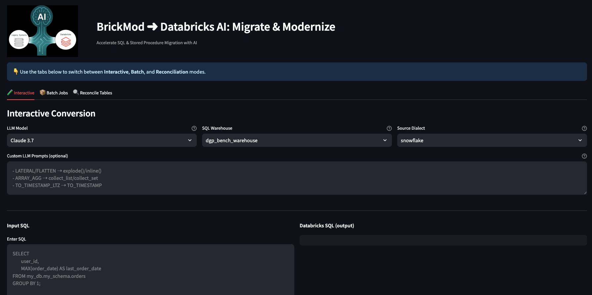
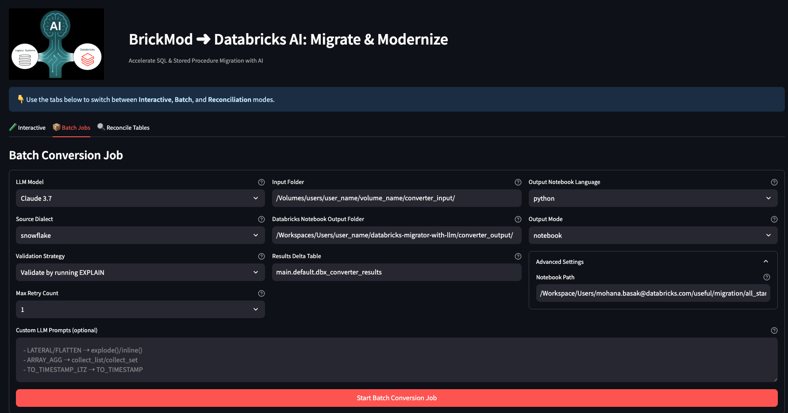
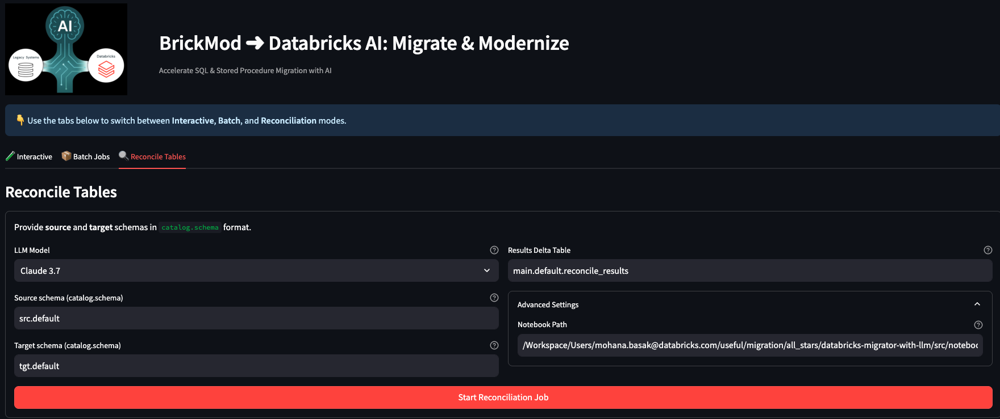
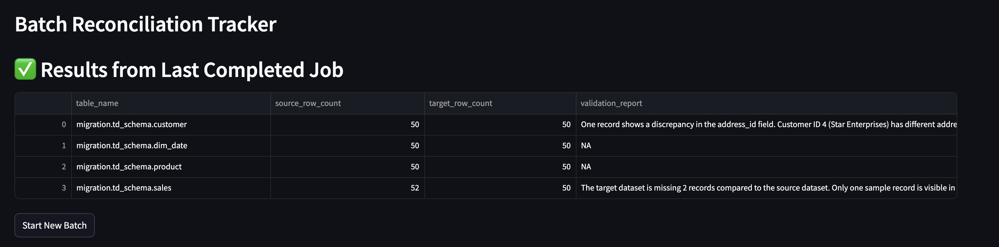

# Legacy System ➜ Databricks Converter

A **Databricks-native web application** for accelerating SQL migration and schema reconciliation from legacy systems (Snowflake, T-SQL, Redshift, Oracle, Teradata, MySQL, PostgreSQL, SSIS, Informatica, etc.) into **Databricks SQL**.  
The app leverages **LLMs** (Claude, Llama, GPT, etc.) for query conversion, validation, and automated fixes.

---

## ✨ Features

### 🔹 1. Interactive Conversion
- Convert individual queries in real time.
- Choose **LLM model**, **SQL Warehouse**, and **Source Dialect**.
- Add **custom prompt instructions** to handle tricky translations.
- Validate queries by running `EXPLAIN` in Databricks.
- **Retry mechanism:** if validation fails, re-submit failed queries with **error context** so the LLM can correct its own mistakes.



---

### 🔹 2. Batch Jobs
- Bulk convert entire folders of SQL files.
- Configure **source dialect**, **input folder**, **output notebook folder**, and **results table**.
- Choose validation strategy:
    - No validation
    - Validate by running `EXPLAIN`
- Failed queries can be **retried** with error feedback.
- Results are persisted in Delta for easy querying and history.



---

### 🔹 3. Reconcile Tables
- Compare **source vs target schemas** (`catalog.schema` format).
- Run reconciliation jobs that:
    - Count rows in source and target.
    - Highlight mismatches.
- Results stored in a Delta table for auditing.
- Useful for validating post-migration data consistency.




---

## 🚀 Quick Start

### 1. Clone into Databricks Git Folder
Clone this repository into a Databricks Git-enabled workspace folder.

### 2. Deploy the app
In the repo root there is a notebook called **`app_deployer`**.  
Open it in Databricks and run all cells. This will automatically:

- Install dependencies
- Deploy the Streamlit app into your workspace
- Make the app available for immediate use

---

## 🔧 Configuration

- **LLM Models**: Select from Claude, GPT, Llama, Gemma, etc.
- **Custom Prompts**: (OPTIONAL) Add dialect-specific hints.
- **Validation**: Toggle validation strategy to balance speed vs correctness.
- **Results Storage**: Batch and reconcile results are persisted in Delta tables.

---

## 🛠️ Retry Logic

Both **Interactive** and **Batch** modes have built-in retry support:
- If validation fails, the app automatically captures the **validation error message**.
- The failed query plus the error context are re-submitted to the LLM.
- The LLM adjusts its output and attempts to generate a corrected query.
- This iterative approach significantly increases the chance of success.

---

## 📂 Project Structure
## Repository Structure

```plaintext  
├── app.py # Main Streamlit app (3 tabs: Interactive, Batch, Reconcile)
├── app_deployer.py # Notebook for auto-deployment in Databricks
├── requirements.txt # Python dependencies
├── src
│   ├── noteboks/ # Notebooks to be run as jobs for batch modes
│   ├── utils/ # Helper modules (prompt handling, model mapping, etc.)
│   └── resources/ # YAML files with LLM prompts
└── README.md
```
---

## 📊 Example Migration Flow

1. Use **Interactive Conversion** to test a few sample queries from Snowflake.
2. Run a **Batch Job** to convert hundreds of SQL files into Databricks notebooks.
3. Execute the **Reconcile Tables** job to ensure source and target schemas match in counts and data samples.

---

